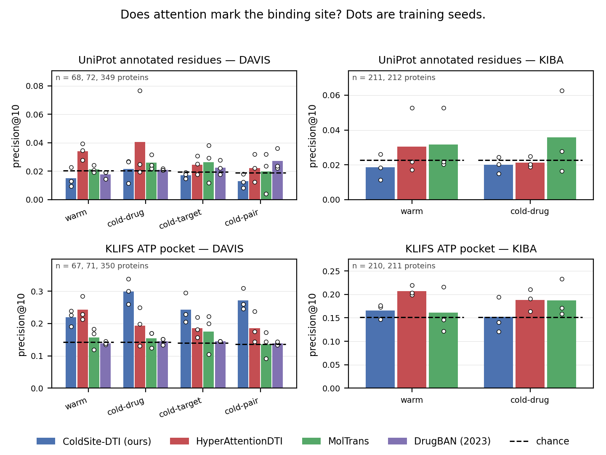
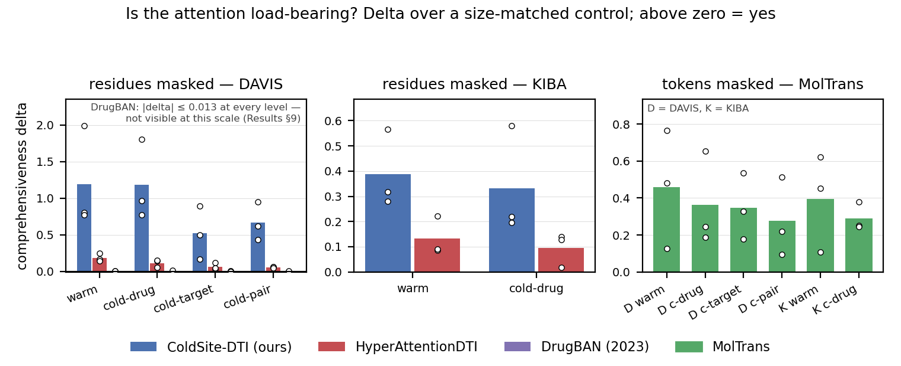
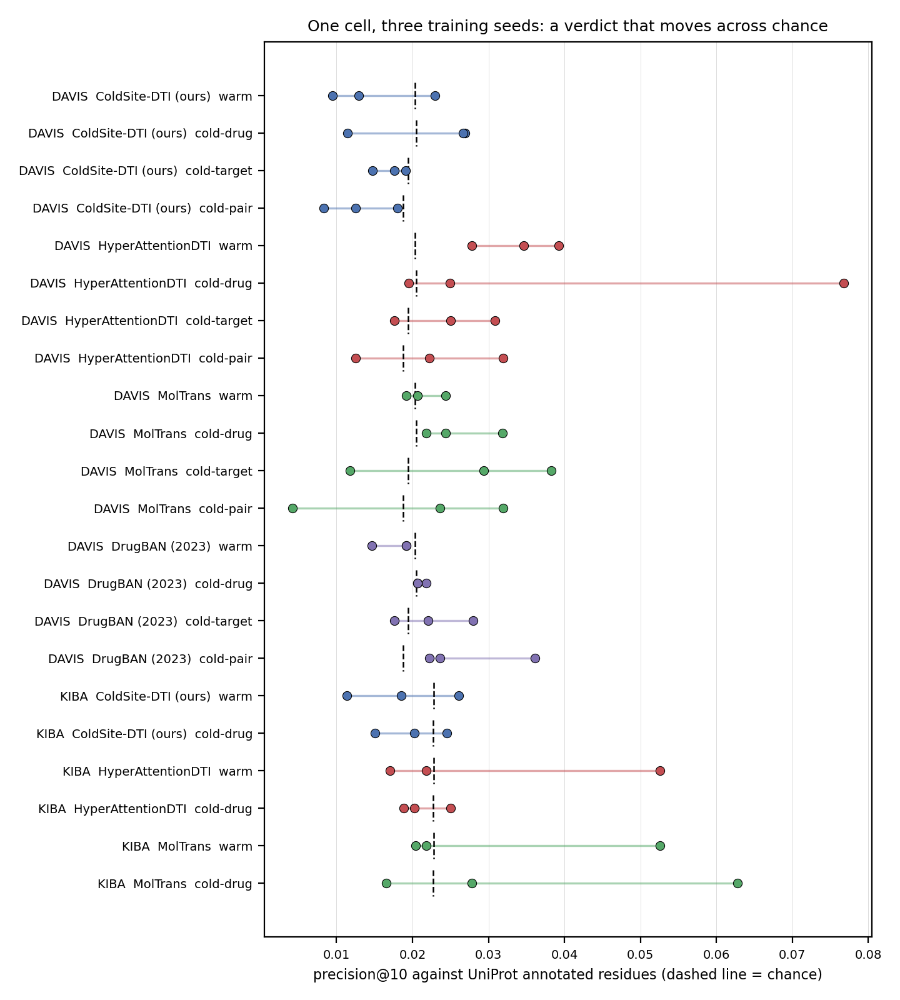
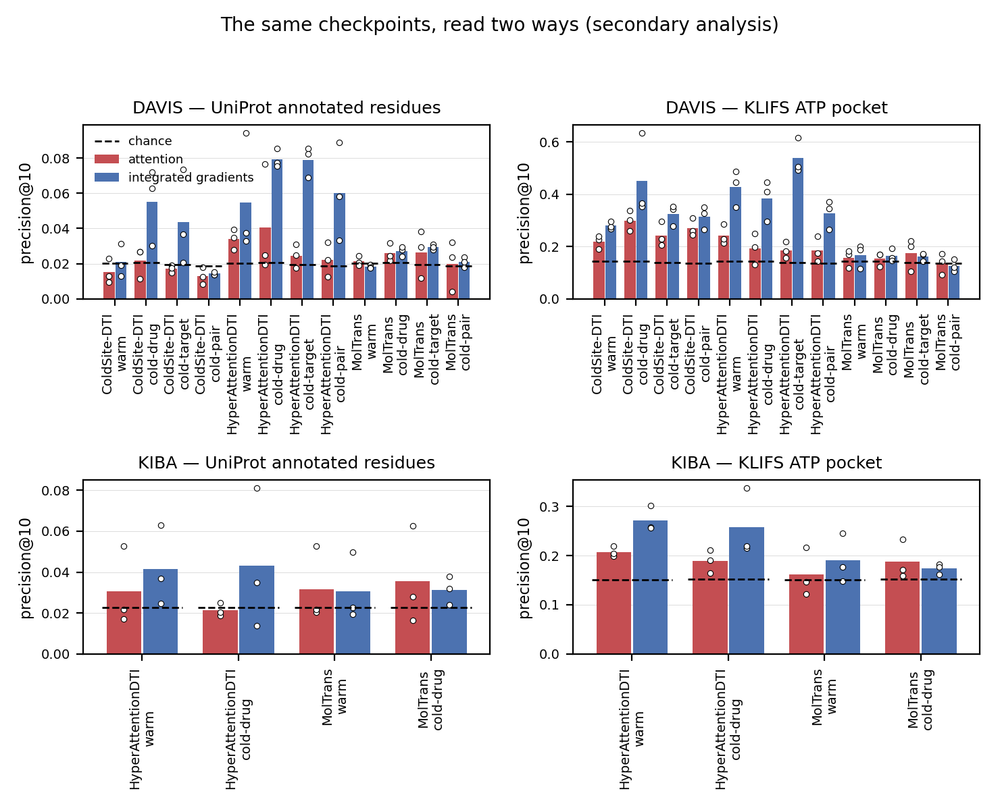

# Does attention in drug–target interaction models mark the binding site? An audit across distribution shift, two benchmarks and four models

**Mahim Agarwal**, supervised by **Dr. Chandra Mohan Dasari**
Draft for supervisor review — 20 September 2026

*This is a condensed, venue-neutral draft assembled from the full section drafts in
`paper/` (introduction, methods, results, discussion, limitations, references), which hold
every number with its source file. Nothing here is a new number: each is traceable to a
committed analysis file. Section references of the form "Results §5" point into
`paper/results.md`.*

---

## Abstract

Attention-based drug–target interaction (DTI) models present attention over the protein as
evidence of where the drug binds; we audit that claim. Four attention-based models (three
published, including DrugBAN, 2023; one ours) and a no-attention anchor were retrained on
identical splits at four levels of shift — random, unseen drug, unseen target, both — three
seeds per cell, on DAVIS (60 cells) and at two levels on KIBA (24 cells). Plausibility was
scored against UniProt residues, the KLIFS ATP pocket and crystallographic contacts, each
against chance, a uniform floor, a positive control and positional, residue-type and
drug-identity nulls; faithfulness by size-matched masking in the space each model reads.
One of twenty DAVIS cells supported the residue-level claim after Holm correction
(HyperAttentionDTI, random split, 1.7× chance) and it did not replicate on KIBA, where none
of eight survived. In twelve of twenty-two three-seed cells the seeds disagree about their
own verdict; the surviving cell is the only one where all three agree. The 2023 model, the
only one whose map changes with the drug, is at chance against the pocket at every level.
What replicated was coarser: the older models' top-ten attention is load-bearing
everywhere, and HyperAttentionDTI's localises the ATP pocket at 1.3–1.5× chance on 422
unseen drugs. Three measurement findings generalise: plausibility depends on an unreported
readout choice, masking faithfulness does not transfer across tokenisations, and integrated
gradients on the same weights survive correction where attention does not (7/12 DAVIS cells
against 1/20; 3/4 on KIBA against 0/8).

---

## 1. What the project asks, and why it is worth asking

Attention-based DTI models routinely display attention over the protein sequence and
conclude that the model has found the binding site. That claim is usually supported on a
random split, by inspecting a handful of examples, from a single training run, and without
a chance level. Three things follow that no published figure can settle:

1. **Does the claim survive distribution shift?** Cold-start generalisation — an unseen
   drug, an unseen target, or both — is the setting these models are built for. An
   explanation that only works on a random split explains the easy case.
2. **Does it replicate?** Across training seeds, and across datasets.
3. **Is the verdict about the model, or about how the attention was read out?** Between the
   tensor inside the network and the one number per residue a figure shows, somebody makes
   reduction choices that no paper reports.

This work is an **audit**, not a new model. We retrain published models with their authors'
own recipes, score their explanations against annotated ground truth with a chance level,
a ceiling, a uniform-attention floor and a battery of nulls, correct once for multiplicity
across the whole family, and report what survives.

**The subjects.** MolTrans (2021), HyperAttentionDTI (2022) and DrugBAN (2023) are
published attention-based models whose papers make interpretability claims. ColdSite-DTI is
our own model, held to exactly the same standard. DeepDTA (2018) has no attention and is
included only as an accuracy anchor, so a reader can see whether the interpretable models
pay an accuracy cost. EviDTI (2025, *Nature Communications*) is audited at the level of its
source code without retraining (§3.7).

---

## 2. Protocol

**Datasets and splits.** DAVIS (442 targets, 68 drugs) is the primary benchmark, split four
ways: random, cold-drug (unseen drugs), cold-target (unseen targets) and cold-pair (both).
KIBA is the replication, at random and cold-drug only — its cold-drug level holds out **422
drugs** where DAVIS holds out 13, which is the axis DAVIS is weakest on. Binary labels use
one shared threshold per dataset (DAVIS pKd ≥ 7.0, KIBA score ≥ 12.1). Every model sees
byte-identical split files.

**Cells.** 3 training seeds × each (model, level). DAVIS: 60 cells (5 models × 4 levels × 3
seeds). KIBA: 24 cells. Every cell was trained to completion, and every checkpoint has a
results file beside it.

**A benchmark problem found along the way.** In the DAVIS protein file that this literature
uses, all 54 mutant targets carry the **wild-type sequence** (442 targets are 379 distinct
sequences), so 12 of 88 cold-target test targets are already seen in training *by sequence*.
Accuracy at the cold levels is therefore reported on targets genuinely unseen by sequence,
by re-scoring each checkpoint with its own trainer's test pass; all 30 recorded AUROCs
reproduce exactly. Leakage inflated cold-target AUROC for **every** model (Results §1b).

**Plausibility** is precision@10: of the ten residues an explanation ranks highest, how many
are binding-site residues? It is always read against that cell's own **chance level** (which
depends on the proteins, their lengths and site counts) and its **ceiling**. Three ground
truths at different resolutions: UniProt's annotated residues (fine), the 85-residue KLIFS
ATP pocket (coarse), and the residues a drug is measured to contact in its own co-crystal
structure (per-pair).

**Faithfulness** is comprehensiveness minus a **size-matched** random-masking control: mask
the ten attended residues, mask ten random ones, and take the difference. Positive means the
attention is load-bearing. The intervention is applied in the space each model reads, which
matters (§3.4).

**Controls, and why they are the substance of the audit.**
- a **uniform** attention map, the metric's own floor;
- a **positive control**: synthetic explanations of known quality, to establish at what dose
  a real signal would have been visible — so a null can be distinguished from a weak test;
- **nulls** for position (a map borrowed from another protein), amino-acid preference
  (attention permuted among residues of the same type) and location within the site-spanning
  stretch;
- a **non-kinase transfer panel** (60 BindingDB proteins), because both benchmarks are
  kinases;
- **alternative readouts** of the same checkpoints, one documented choice changed at a time.

**Statistics.** A split-level permutation test per cell; a cell's p is the **median over its
three seeds**, never the smallest. Holm–Bonferroni once across each dataset's whole family
(20 cells on DAVIS, 8 on KIBA), never per model. Results are reported as mean ± sd over
seeds; a difference smaller than the seed spread is not reported as a difference.

---

## 3. Results

### 3.1 The models predict well; the anchor shows no interpretability tax

DAVIS test AUROC, mean ± sd over three seeds (cold levels on targets unseen by sequence):

| model | random | cold-target | cold-drug | cold-pair |
|---|---|---|---|---|
| DeepDTA (anchor, no attention) | 0.929 ± 0.002 | 0.884 ± 0.003 | 0.692 ± 0.044 | 0.749 ± 0.044 |
| ColdSite-DTI (ours) | 0.924 ± 0.001 | 0.835 ± 0.015 | 0.721 ± 0.008 | 0.607 ± 0.128 |
| HyperAttentionDTI | **0.937 ± 0.005** | **0.893 ± 0.001** | **0.760 ± 0.042** | 0.713 ± 0.050 |
| MolTrans | 0.923 ± 0.002 | 0.833 ± 0.008 | 0.685 ± 0.020 | 0.530 ± 0.024 |
| DrugBAN (2023) | 0.891 ± 0.006 | 0.801 ± 0.012 | 0.695 ± 0.033 | 0.559 ± 0.040 |

The levels are **not** a ladder of increasing difficulty: on DAVIS an unseen target costs
little and an unseen drug costs a great deal, because DAVIS has only 68 drugs. KIBA, with
422 held-out drugs, shows a much smaller drop (0.086–0.107 against DAVIS's 0.177–0.238), so
DAVIS's cold-drug severity is a property of its 13-drug split rather than of unseen
chemistry. MolTrans at cold-pair predicts at chance (0.530), which is reported beside its
explanation scores: an explanation of a prediction no better than chance explains nothing.

### 3.2 The headline: one cell of twenty survives correction

**Figure 1.** precision@10 for every model, level and dataset, against UniProt's annotated
residues (top) and the KLIFS ATP pocket (bottom). Bars are means over three seeds, circles
are the seeds, the dashed segment is that cell's chance level.

Against UniProt's annotated residues, with one Holm correction over all twenty DAVIS cells,
**one cell survives**: HyperAttentionDTI on the random split, at 1.7× chance (precision@10
0.034 against 0.020). Re-run at 10,000 permutations its p is 0.0001 — the smallest the test
can return — so it survives with a 25-fold margin, and no other verdict changes.

That cell beats every null: a map borrowed from another protein, attention permuted among
residues of the same amino acid, and attention permuted within the site-spanning stretch. So
on the split published work reports, for the model that generalises best, the claim holds —
and it is **small**: worth an equivalent dose of about 1% of the true annotated sites.

**It does not survive shift.** The same model reads 1.26× chance at cold-target and 1.18× at
cold-pair, beating nothing. MolTrans sits at the uniform control's floor at every level, and
DrugBAN is at chance everywhere (§3.9).

**It does not replicate.** On KIBA, **none of eight cells** survives; the same model at the
same level is above chance in one seed of three (§3.10).

### 3.3 Coarse, not fine: the pocket instead of the residues

Against the 85-residue KLIFS ATP pocket the picture is different: HyperAttentionDTI reads
1.70× chance at random and 1.33–1.37× at all three cold levels, and ColdSite-DTI is above
chance in all twelve of its DAVIS cells (1.5–2.1×). So attention does carry coarse
information — it concentrates on the kinase domain and the pocket region — while missing the
annotated residues inside it. **Faithful and coarsely plausible, but not finely plausible**
is the audit's summary of the two 2021–2022 subjects.

### 3.4 The attention is used — at the dose we specified

**Figure 4.** Comprehensiveness minus a size-matched random-masking control. Above zero
means masking what the explanation points at moves the prediction more than masking
arbitrary input of the same size.

Masking the ten attended residues moves the prediction more than masking ten random ones in
**every cell of both datasets** for the three 2021–2022 models. Two caveats belong with that
claim, and both are in the paper:

- **The unit must match the model.** MolTrans reads sub-word tokens, so masking ten residues
  re-segments its protein: the attended set changes 48% of its tokens and ten random residues
  change 95% — a factor of 124 for one protein. Under that mismatched test its delta was
  negative in 11 of 12 cells, which would have read as "its attention points at residues that
  matter *less* than arbitrary ones". Measured in token space with both arms removing the
  same number of tokens, the sign reverses in all twelve. **A masking metric is only
  interpretable when both arms are the same size of intervention.**
- **The dose matters.** At k = 50 instead of k = 10, HyperAttentionDTI's margin survives only
  at the random split. What is load-bearing under shift is its top ten residues, not its top
  fifty.

### 3.5 A single training run cannot support the claim

**Figure 2.** All twenty-two three-seed cells as seed dots against their chance level.

Counted over every cell rather than anecdotally: **in 12 of 22 cells the three seeds
disagree** about their own verdict, and in **21 of 22 the spread across seeds is larger than
the cell's distance from chance**. A paper reporting one training run would have had an
above-chance, uncorrected result available in twelve of these cells — including cells this
audit reports as null.

There is a reassurance inside that number, and it belongs to the method. Exactly one cell has
all three seeds above α individually, and it is the same cell that survives Holm correction.
Agreement among replicate runs and family-wise error control were computed independently and
select the same cell.

### 3.6 The verdict can belong to the readout, not the model

Scoring the same checkpoints through readouts another author could reasonably have picked
(one documented choice changed at a time):

- The top-ten residues of an alternative readout overlap the published readout's by **2–12%**.
  Two defensible readings of one checkpoint highlight almost disjoint residues.
- One choice moves a verdict across chance: HyperAttentionDTI against the pocket at
  cold-target reads 0.367 (2.6× chance) under channel-max and **0.081** — *below* chance —
  under a receptive-field projection, against 0.186 as published.
- **The audit's own verdicts survive this.** No readout of any model clears chance against
  the annotated residues, and none lifts MolTrans above the pocket's floor.

### 3.7 State which inputs the explanation is a function of

Whether an explanation *can* depend on the drug is a property of the computation graph, not
an empirical question — and it is checkable in a minute, before publication.

**EviDTI (2025, *Nature Communications*)** presents per-residue attention for four
drug–target complexes and concludes that high-attention residues coincide with the binding
site. Its attention is computed from the protein's language-model embedding alone; no drug
tensor reaches it. For a fixed protein, **every drug yields the identical map**, for any
weights. The claim is not refuted by a better measurement — it is refuted by the source code.

Applied to our own subjects by measurement (25 proteins, four drugs each, 150 drug pairs):

| explanation | top-10 residues shared between different drugs |
|---|---|
| MolTrans, interaction map *(its published artefact)* | **1.1 / 10** |
| DrugBAN | 4.5 / 10 |
| HyperAttentionDTI | 9.7 / 10 |
| MolTrans, encoder self-attention | **10.0 / 10** (identical, always) |

This check changed our own protocol. MolTrans's paper visualises the drug × protein
**interaction map**, not the encoder attention we scored by default, so we implemented and
scored that map too: it is at chance in every cell of both datasets, so the MolTrans verdict
holds whichever map is read. The ordering above is also the paper's sharpest architectural
result: **the two explanations that vary most with the drug agree least with where drugs
bind.** Conditioning an explanation on the drug is necessary for a per-pair claim and buys
nothing by itself.

### 3.8 The gradient finds what the attention misses

**Figure 3.** Attention (red) beside integrated gradients (blue) on identical trained
weights.

Integrated gradients on the *same checkpoints* — same ground truth, same proteins, same test,
only the explanation changed — survive Holm in **7 of 12 DAVIS cells against 1 of 20 for the
attention**, and in **3 of 4 KIBA cells against 0 of 8**, reaching 1.9–4.1× chance at levels
where the attention is at chance. For two of the three models with a gradient arm, the
attention therefore **under-reports a binding site the model does represent**. A weak
attention map often indicts the report rather than the model. (The third model is the control
for that claim: its gradient and attention agree at the floor, so its failure is the model.)

### 3.9 Does the verdict bind on a current model? DrugBAN (2023)

The other subjects are from 2021–2022, so the first question a reviewer asks is whether the
verdict applies to what people build now. DrugBAN is the answer: interpretability is in its
title, its bilinear attention is indexed by drug atom and protein position, and it is
maintained and MIT-licensed. Trained on the identical splits with its authors' recipe, 12
DAVIS cells:

- **Plausibility:** at chance against *both* ground truths in all 12 cells. One seed-cell of
  twelve clears α uncorrected against UniProt, none against the pocket. It is the only
  subject without even the coarse signal (HyperAttentionDTI is above pocket chance in 9 of 12
  seed-cells, ColdSite-DTI in 12 of 12, DrugBAN in 0 of 12).
- **Faithfulness:** not load-bearing — deltas within ±0.013 of zero, sign flipping between
  seeds. At k = 50, where the test has three times the power, three of four levels stay at
  zero and only cold-drug shows a small positive margin.
- **Not a readout artefact:** its two attention heads have learned the same map, and
  alternative reductions leave its top residues essentially unchanged.
- **Its map does move with the drug** (4.5/10), more than any other model's except MolTrans's
  interaction map.
- **Controls:** no transfer off kinases (0.010–0.012 against its own kinase cells'
  0.018–0.027). Its one above-chance seed-cell (cold-pair, seed 1) beats all four positional
  nulls, while the other two seeds of that cell beat none — seed dependence reaching even a
  model that is otherwise at chance. It is scored on 59 of the panel's 60 proteins: one
  ligand exceeds the 290-atom cap of DrugBAN's own data loader, and that row is dropped and
  reported.

**What DrugBAN adds:** the audit's verdict is not an artefact of older architectures. The
2023 model, with the strongest structural case for a per-pair explanation, agrees with
binding sites least of all, at every level of shift.

### 3.10 The replication: KIBA

KIBA was trained and analysed after every DAVIS result was fixed, with the same code and no
parameter chosen by looking at KIBA.

| DAVIS finding | on KIBA |
|---|---|
| The one residue-level survivor (1 of 20 cells) | **does not replicate** — 0 of 8; that cell is above chance in one seed of three |
| Attention finds the pocket region, including under shift | **replicates** for HyperAttentionDTI at a 422-drug cold level; **seed-dependent** for ColdSite-DTI (3 of 6 seed-cells) |
| Attention is load-bearing at every level | **replicates** for all three models (18 of 18 cells) |
| MolTrans sits at the uniform floor | holds in 2 seeds of 3 |
| Cold-drug collapses accuracy | **does not replicate** — an artefact of DAVIS's 13-drug split |
| The gradient beats the attention (7 of 12 cells) | **replicates** (3 of 4 cells) |

---

## 4. What this establishes

**For the field's claims.** Across two datasets, four models and 84 trained cells, no
residue-level attention claim survives family-wise correction and replication. What survives
is weaker and worth stating plainly: attention in these models is **used** by the model, and
it concentrates on the **pocket region** rather than on binding residues. A published figure
showing attention peaks at annotated residues, from one seed on a random split, is not
evidence for the claim it illustrates.

**For interpretability measurement, beyond DTI.** Three findings generalise:
1. Attention-based plausibility is largely a property of an **unreported readout choice**.
2. Masking-based faithfulness **does not transfer across tokenisations** — and can invert its
   own sign when the two arms are not size-matched.
3. The **gradient of the same weights** recovers what the attention misses, so a weak
   attention map often indicts the report rather than the model.

**A cheap check the field can adopt:** state which inputs the explanation is a function of.
One published claim (EviDTI) fails it on inspection; one of our own readouts failed it too,
which is how we caught it.

---

## 5. Limitations (stated, not hidden)

- **Both benchmarks are kinase panels**, so the family confound cannot be stratified away
  inside them. The 60-protein non-kinase panel is the substitute, and it shows no transfer.
- **DAVIS's sequence problems** (mutants carrying wild-type sequences) affect every model;
  cold-level accuracy is re-scored on genuinely unseen targets, and explanation metrics drop
  seen-by-sequence and pocketless targets.
- **"Load-bearing" is a statement at k = 10**, the pre-specified dose; at k = 50 the margins
  shrink under shift.
- **MolTrans is scored through two readouts** and neither is privileged; faithfulness and the
  per-pair contact analysis use the default (encoder) readout only.
- **DrugBAN is DAVIS-only** and has no integrated-gradient arm (its drug side is a graph).
- **ColdSite-DTI's KIBA cells were added after** the rest of the KIBA arm, and are reported as
  an addition rather than as part of the pre-specified scope. Its pocket signal does not
  replicate cleanly there — a result against our own model.
- **Three seeds per cell** is enough to show instability, not to quantify it precisely.

---

## 6. Status and open decisions for discussion

**Complete:** all training (84 cells across two datasets), the full analysis pipeline,
both audits with Holm correction, the replication, the controls and nulls, the readout and
seed analyses, the figures, and a test suite that passes in both environments. Every number
in this draft traces to a committed file, and re-computing the audits on different hardware
reproduced every p-value exactly.

**Open, for your guidance:**
1. **Venue.** Not chosen. The candidates are *Briefings in Bioinformatics* (benchmarking and
   critical-assessment papers, flexible length), *Bioinformatics* (needs heavy condensing) and
   ISMB (most competitive, tightest page limit). The choice sets the target length and the
   citation style, both of which are still open.
2. **Length.** The full section drafts are ~27,600 words; a journal main text is roughly
   5,000–8,000. What belongs in the main text versus a supplement is the largest remaining
   decision.
3. **Framing.** Is the paper best presented as an audit of published claims (current framing),
   or as a benchmark-and-protocol contribution with the audit as its demonstration?
4. **Remaining work items:** a repository DOI for release, and — optional, not required for
   the claims — integrated gradients for DrugBAN, DrugBAN on KIBA, and readout variants on
   KIBA. All analyses the claims rest on are complete.

---

## References (selected; full verified list in `paper/references.md`)

- Öztürk H, Özgür A, Ozkirimli E. DeepDTA. *Bioinformatics* 34:i821–i829 (2018).
- Huang K, et al. MolTrans. *Bioinformatics* 37:830–836 (2021).
- Zhao Q, et al. HyperAttentionDTI. *Bioinformatics* 38:655–662 (2022).
- Bai P, et al. Interpretable bilinear attention network with domain adaptation improves
  drug–target prediction (DrugBAN). *Nature Machine Intelligence* 5:126–136 (2023).
- Zhao Y, et al. Evidential deep learning-based drug-target interaction prediction (EviDTI).
  *Nature Communications* 16:6915 (2025).
- Davis MI, et al. Comprehensive analysis of kinase inhibitor selectivity. *Nature
  Biotechnology* 29:1046–1051 (2011).
- Tang J, et al. Making sense of large-scale kinase inhibitor bioactivity data sets (KIBA).
  *J. Chem. Inf. Model.* 54:735–743 (2014).
- van Linden OPJ, et al. KLIFS. *J. Med. Chem.* 57:249–277 (2014); Kanev GK, et al. KLIFS:
  an overhaul after the first 5 years. *Nucleic Acids Res.* 49:D562–D569 (2021).
- The UniProt Consortium. UniProt in 2025. *Nucleic Acids Res.* 53:D609–D617 (2025).
- Jain S, Wallace BC. Attention is not Explanation. *NAACL-HLT* 3543–3556 (2019);
  Wiegreffe S, Pinter Y. Attention is not not Explanation. *EMNLP-IJCNLP* 11–20 (2019).
- DeYoung J, et al. ERASER. *ACL* 4443–4458 (2020) — comprehensiveness and sufficiency.
- Sundararajan M, Taly A, Yan Q. Axiomatic Attribution for Deep Networks. *ICML* (2017).
- Holm S. A simple sequentially rejective multiple test procedure. *Scand. J. Stat.*
  6:65–70 (1979).
